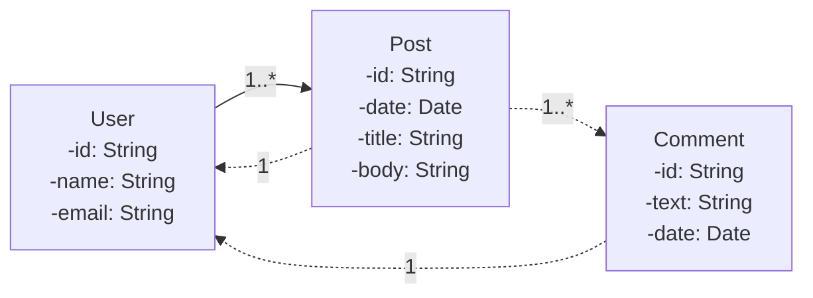

# Spring-Boot-MongoDB

## Classes Diagram

```mermaid
graph LR
  User["User<br/>-id: String<br/>-name: String<br/>-email: String"]
  Post["Post<br/>-id: String<br/>-date: Date<br/>-title: String<br/>-body: String"]
  Comment["Comment<br/>-id: String<br/>-text: String<br/>-date: Date"]

  User --> |1..*| Post
  Post -.->|1..*| Comment
  Post -.->|1| User
  Comment -.->|1| User
```
