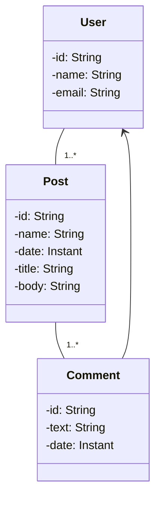

# spring-boot-mongodb

## Classes Diagram

```mermaid
classDiagram
  class User {
    -id: String
    -name: String
    -email: String    
  }
  class Post {
    -id: String
    -name: String
    -date: Instant
    -title: String
    -body: String
  }
  class Comment {
    -id: String
    -text: String
    -date: Instant
  }

  User -- "1..*" Post
  Post -- "1..*" Comment
  Comment --> User
```
